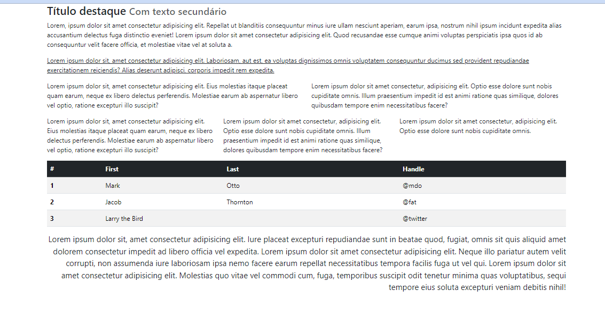

<H1>ATVIDADE PRÁTICA BOOTSTRAP</H1>

Atividade prárica para para exercitar a utilização do FrameWork Bootstrap, com responsividade e GRID

<h2>Questão 1</h2>

<h2>Questão 2</h2>

<h2>Questão 3</h2>

<h2>Questão 4</h2>
<a href="https://github.com/Leokrindges/Curriculo_Digital" target="_blank">Link para atividade 4</a>

<h2>Questão 5</h2>
